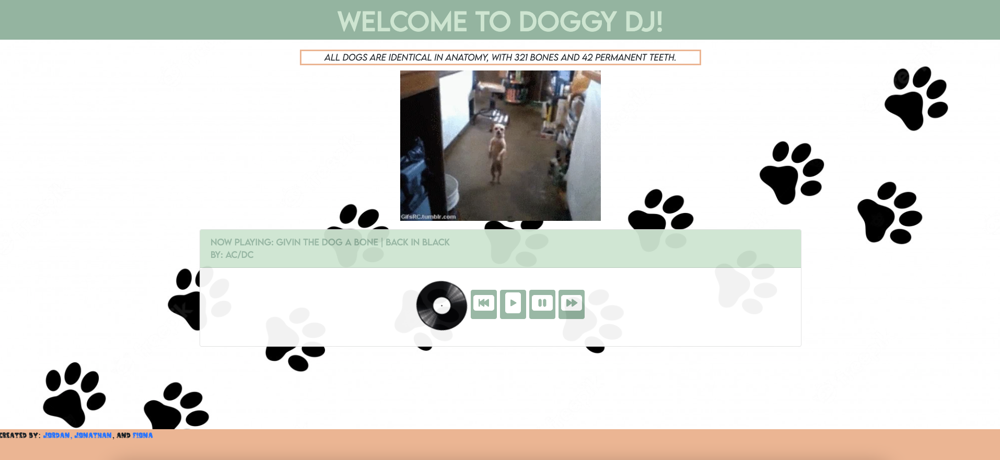

# Doggy DJ

Doggy Dj is a fun and handy dog themed music player and dog fact hotspot. Perfect for doggo birthday parties and for any dog fan to peruse!

**_Tech Stack_**

- HTML
- CSS
- JavaScript
- Flexbox
- Bootstrap
- APIs (Deezer and Dog API)

**_MVP_**

- Display and play a fun dog themed music player.
- User has ability to play, pause, and skip, and hear the song again.
- Generate a random dog fact upon user visit.
- Generate a random song upon user visit.
- Generate a dog gif for user happiness boost.
- Deployed for user use.

## Screenshots of App

Here's the team and our project! Look at that pug go.

Top of the screen

Media player.

Full screen from the user's point of view.

## Developer Team

- Fiona Eckert - [Github][1]
- Jonathan Batalla - [Github][2]
- Jordan Boardman - [Github][3]

[1]: https://github.com/fionaeckert
[2]: https://github.com/Jon-115
[3]: https://github.com/jordanboardman
